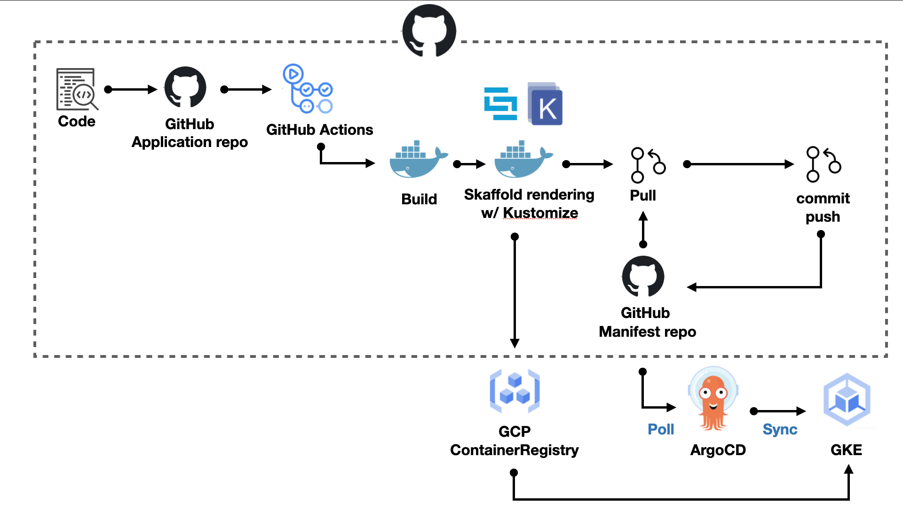

# k8s-process

# 工具

- Kustomize
- Skaffold
- ArgoCD

# Git Repo

- application repo
  - 包含 source code, Dockerfile
- manifest
  - 包含 k8s
  - [k8s-process-manifest](https://github.com/JouYin-Chen/k8s-process-manifest)

# Flow

1. code push to application repo
2. CICD by GitHub action
   - build image
   - push image & render k8s manifest
   - pull manifest repo
   - push new manifest.yaml & commit to manifest repo
3. argoCD poll manifest repo
4. argoCD sync GKE

# 流程圖

